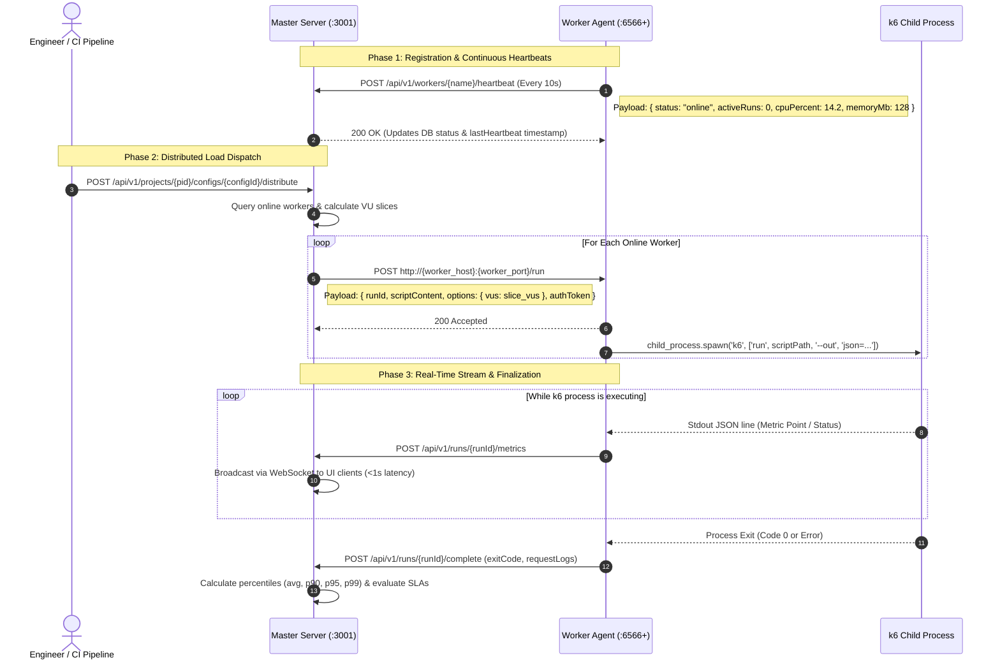

# TenjinT6 — Master & Worker Distributed Deployment Guide

This document provides complete, step-by-step instructions and architectural reference for deploying **TenjinT6** in a **Master-Worker** (Central API + Distributed Worker Agents) topology across three distinct execution environments:
1. **Bare-Metal / Virtual Machine (VM) Multi-Node Deployment**
2. **Docker & Container Orchestration**
3. **Kubernetes (`K8s`) Dynamic Pod Provisioning**

---

## Table of Contents
1. [Architecture & Communication Protocol](#1-architecture--communication-protocol)
2. [Environment Variables Reference](#2-environment-variables-reference)
3. [Deployment Mode 1: Bare-Metal & Virtual Machines](#3-deployment-mode-1-bare-metal--virtual-machines)
4. [Deployment Mode 2: Docker & Container Orchestration](#4-deployment-mode-2-docker--container-orchestration)
5. [Deployment Mode 3: Kubernetes Dynamic Pod Provisioning](#5-deployment-mode-3-kubernetes-dynamic-pod-provisioning)
6. [Dispatching Distributed Test Runs](#6-dispatching-distributed-test-runs)
7. [API Endpoints & Troubleshooting](#7-api-endpoints--troubleshooting)

---

## 1. Architecture & Communication Protocol

In TenjinT6, the **Master** (`packages/backend`) acts as the central orchestration server, API gateway, and results ingester. The **Workers** (`packages/worker-agent`) are lightweight, stateless agents that spawn the native **`k6` CLI binary** as child processes to generate load.



### Core Mechanisms:
* **Heartbeat Mechanism**: Worker agents transmit a ping to the Master every `10 seconds` (`HEARTBEAT_INTERVAL`). If a worker stops sending heartbeats, the Master marks it offline and prevents new assignments.
* **Dynamic VU Slicing**: When distributing a run (`/distribute`), the Master splits total Virtual Users (`totalVUs`) evenly across all online workers:
  $$\text{vusPerWorker} = \left\lfloor \frac{\text{totalVUs}}{\text{onlineWorkers.length}} \right\rfloor$$
  *Any remainder VUs are automatically assigned to the final worker so 100% of the requested load is generated.*

---

## 2. Environment Variables Reference

### Master Node (`packages/backend/.env`)
| Variable | Default Value | Description |
| :--- | :--- | :--- |
| `PORT` | `3001` | HTTP and WebSocket server listening port |
| `DATABASE_URL` | `file:./dev.db` | SQLite (`file:...`) or PostgreSQL connection string |
| `RABBITMQ_URL` | `amqp://localhost:5672` | RabbitMQ broker URL for background job queuing |
| `JWT_SECRET` | `change-me-in-prod` | Secret key used to sign and verify user JWT tokens |
| `NODE_ENV` | `production` | Execution environment (`development` vs `production`) |

### Worker Agent (`packages/worker-agent`)
| Variable | Default Value | Description |
| :--- | :--- | :--- |
| `AGENT_PORT` | `6566` | Port on which the Worker Agent listens for `POST /run` commands |
| `AGENT_NAME` | `agent-6566` | Unique identifier used for heartbeat registration on the Master |
| `CENTRAL_API_URL` | `http://localhost:3001` | Absolute URL of the Master server API endpoint |
| `HEARTBEAT_INTERVAL` | `10000` | Milliseconds between status pings sent to the Master (`10000` = 10s) |

---

## 3. Deployment Mode 1: Bare-Metal & Virtual Machines

Use this setup when deploying across dedicated physical servers or VMs on an internal network (e.g., AWS EC2, On-Premise VMs).

### Step 1: Provision the Master Server (`192.168.1.100`)
1. **Install Prerequisites**: Ensure Node.js 20+ LTS and Docker (for RabbitMQ) are installed.
2. **Launch RabbitMQ Broker**:
   ```bash
   docker run -d --name tenjint6-rabbit -p 5672:5672 -p 15672:15672 rabbitmq:3-management-alpine
   ```
3. **Configure & Start Master API**:
   ```bash
   git clone <repo-url> tenjint6 && cd tenjint6
   npm install && npm run build -w packages/shared && npm run build -w packages/backend
   
   # Set environment variables
   export PORT=3001
   export DATABASE_URL="file:./data/tenjint6.db"
   export RABBITMQ_URL="amqp://localhost:5672"
   
   # Initialize database & start server
   npm run db:push -w packages/backend
   npx tsx packages/backend/src/index.ts
   ```

### Step 2: Provision Remote Worker Nodes (`192.168.1.101`, `192.168.1.102`)
1. **Install Node.js 20+ & k6 Binary**:
   ```bash
   # Ubuntu/Debian k6 installation
   sudo gpg -k || true
   sudo gpg --no-default-keyring --keyring /usr/share/keyrings/k6-archive-keyring.gpg --keyserver hkp://keyserver.ubuntu.com:80 --recv-keys C5AD194E80608552
   echo "deb [signed-by=/usr/share/keyrings/k6-archive-keyring.gpg] https://dl.k6.io/deb stable main" | sudo tee /etc/apt/sources.list.d/k6.list
   sudo apt-get update && sudo apt-get install -y k6 nodejs
   ```
2. **Build & Launch Worker Agent**:
   ```bash
   git clone <repo-url> tenjint6 && cd tenjint6
   npm install && npm run build -w packages/shared
   
   # Start Worker pointing to the Master Server
   AGENT_NAME="worker-us-east-1" \
   AGENT_PORT=6566 \
   CENTRAL_API_URL="http://192.168.1.100:3001" \
   npx tsx packages/worker-agent/src/index.ts
   ```

### Step 3: Register Workers on the Master
Run this `curl` command on the Master (or add via Project Settings in UI) to register each worker:
```bash
curl -X POST http://192.168.1.100:3001/api/v1/projects/<project-id>/workers \
  -H "Content-Type: application/json" \
  -d '{
    "name": "worker-us-east-1",
    "url": "http://192.168.1.101:6566",
    "capacity": 1000,
    "launchType": "local"
  }'
```
*Within 10 seconds, the worker status will change to `online` upon receipt of its first heartbeat.*

---

## 4. Deployment Mode 2: Docker & Container Orchestration

### Step 1: Build Container Images
From the monorepo root directory:
```bash
# Build Master Backend Image
docker build -f packages/backend/Dockerfile -t tenjint6/backend:latest .

# Build Worker Agent Image (Includes Alpine + k6 binary)
docker build -f packages/worker-agent/Dockerfile -t tenjint6/worker-agent:latest .
```

### Step 2: Master & RabbitMQ Compose Setup (`docker-compose.master.yml`)
```yaml
version: '3.8'

services:
  rabbitmq:
    image: rabbitmq:3-alpine
    ports:
      - "5672:5672"
    restart: unless-stopped

  backend:
    image: tenjint6/backend:latest
    ports:
      - "3001:3001"
    environment:
      - DATABASE_URL=file:/app/data/tenjint6.db
      - RABBITMQ_URL=amqp://rabbitmq:5672
      - PORT=3001
      - NODE_ENV=production
    volumes:
      - backend-data:/app/data
    depends_on:
      - rabbitmq
    restart: unless-stopped

volumes:
  backend-data:
```

### Step 3: Worker Node Compose Setup (`docker-compose.worker.yml`)
Run this on any dedicated load-generator host:
```yaml
version: '3.8'

services:
  worker-agent-1:
    image: tenjint6/worker-agent:latest
    network_mode: "host"
    environment:
      - AGENT_NAME=docker-worker-node-1
      - AGENT_PORT=6566
      - CENTRAL_API_URL=http://192.168.1.100:3001
      - HEARTBEAT_INTERVAL=10000
    restart: unless-stopped

  worker-agent-2:
    image: tenjint6/worker-agent:latest
    network_mode: "host"
    environment:
      - AGENT_NAME=docker-worker-node-2
      - AGENT_PORT=6567
      - CENTRAL_API_URL=http://192.168.1.100:3001
      - HEARTBEAT_INTERVAL=10000
    restart: unless-stopped
```
```bash
# Launch containers on worker host
docker-compose -f docker-compose.worker.yml up -d
```

---

## 5. Deployment Mode 3: Kubernetes Dynamic Pod Provisioning

TenjinT6 features an integrated Kubernetes Controller (`K8sManager`) that allows the Master to dynamically provision, monitor, and terminate Worker Pods on demand.

### Step 1: Configure Cluster RBAC Permissions
Apply this RBAC manifest so the Master Pod has rights to manage Worker Pods inside its namespace:
```yaml
apiVersion: v1
kind: ServiceAccount
metadata:
  name: tenjint6-master-sa
  namespace: load-testing
---
apiVersion: rbac.authorization.k8s.io/v1
kind: Role
metadata:
  name: tenjint6-worker-manager-role
  namespace: load-testing
rules:
- apiGroups: [""]
  resources: ["pods", "pods/status", "pods/log"]
  verbs: ["get", "list", "watch", "create", "delete", "patch"]
---
apiVersion: rbac.authorization.k8s.io/v1
kind: RoleBinding
metadata:
  name: tenjint6-worker-manager-binding
  namespace: load-testing
subjects:
- kind: ServiceAccount
  name: tenjint6-master-sa
  namespace: load-testing
roleRef:
  kind: Role
  name: tenjint6-worker-manager-role
  apiGroup: rbac.authorization.k8s.io
```

### Step 2: Configure Project K8s Target via API / Settings
In Project Settings, define the container registry and target namespace:
```json
{
  "k8sConfig": {
    "namespace": "load-testing",
    "image": "tenjint6/worker-agent:latest",
    "imagePullPolicy": "Always"
  }
}
```

### Step 3: Dynamic Pod Lifecycle Operations
When you register a worker with `launchType: "kubernetes"`:
```bash
curl -X POST http://master-service.load-testing.svc.cluster.local:3001/api/v1/projects/<pid>/workers \
  -H "Content-Type: application/json" \
  -d '{
    "name": "k8s-heavy-agent",
    "capacity": 5000,
    "launchType": "kubernetes",
    "namespace": "load-testing"
  }'
```
You can launch or stop the Kubernetes Pod dynamically via the Master API:
* **Start K8s Worker Pod**:
  ```bash
  curl -X POST http://master-service:3001/api/v1/workers/<worker-db-id>/start
  ```
  *The Master spawns a Pod named `worker-k8s-heavy-agent` configured with `CENTRAL_API_URL` pointing back to the Master.*
* **Check Pod Status**:
  ```bash
  curl http://master-service:3001/api/v1/workers/<worker-db-id>/status
  # Returns: { "running": true, "launchType": "kubernetes", "podPhase": "Running" }
  ```
* **Stop / Terminate K8s Pod**:
  ```bash
  curl -X POST http://master-service:3001/api/v1/workers/<worker-db-id>/stop
  ```

---

## 6. Dispatching Distributed Test Runs

Once workers are registered and show `status: "online"`, you can trigger a distributed run across all active workers:

### Via REST API (`POST /distribute`)
```bash
curl -X POST http://192.168.1.100:3001/api/v1/projects/<pid>/configs/<config-id>/distribute \
  -H "Authorization: Bearer <your-jwt-or-pat>" \
  -H "Content-Type: application/json"
```

### Response Example:
```json
{
  "run": {
    "id": "c3a1b2d4-e5f6-7890-abcd-ef1234567890",
    "status": "running",
    "testConfigId": "config-abc-123"
  },
  "dispatchResults": [
    {
      "workerId": "worker-db-id-1",
      "workerName": "worker-us-east-1",
      "workerUrl": "http://192.168.1.101:6566",
      "vus": 500,
      "accepted": true
    },
    {
      "workerId": "worker-db-id-2",
      "workerName": "worker-us-east-2",
      "workerUrl": "http://192.168.1.102:6566",
      "vus": 500,
      "accepted": true
    }
  ]
}
```
*The Master automatically splits 1000 VUs into two slices of 500 VUs and streams aggregated live metrics via `/api/v1/runs/<run-id>/stream` over WebSockets.*

---

## 7. API Endpoints & Troubleshooting

### Worker Management Endpoints
| Method | Endpoint | Description |
| :--- | :--- | :--- |
| `GET` | `/api/v1/projects/:pid/workers` | List all registered workers and their current status (`online`/`offline`/`running`) |
| `POST` | `/api/v1/projects/:pid/workers` | Register a new worker node (`local` or `kubernetes` launch type) |
| `POST` | `/api/v1/workers/heartbeat` | Heartbeat ingestion endpoint pinged by standalone worker agents |
| `POST` | `/api/v1/workers/:id/start` | Start local child process or spawn Kubernetes worker pod |
| `POST` | `/api/v1/workers/:id/stop` | Terminate local child process or delete Kubernetes worker pod |
| `GET` | `/api/v1/workers/:id/status` | Get detailed process PID or Kubernetes `podPhase` status |
| `GET` | `/api/v1/workers/k8s-pods?projectId=:pid` | List all running Kubernetes pods matching label `app=tenjint6-worker` |

### Common Troubleshooting

#### 1. Worker remains `offline` after starting
* **Cause**: Network barrier preventing `POST /api/v1/workers/heartbeat` from reaching the Master.
* **Fix**: Verify `CENTRAL_API_URL` on the worker exactly matches the accessible IP/domain of the Master (`http://192.168.1.100:3001` vs `http://localhost:3001`). Check master logs for heartbeat errors.

#### 2. Master reports `All workers rejected the dispatch` during `/distribute`
* **Cause**: Workers are registered with `status: "online"`, but the Master cannot reach the `worker.url` over HTTP (`http://{worker-ip}:6566/run`).
* **Fix**: Ensure firewalls/security groups on the worker host allow inbound traffic on `AGENT_PORT` (`6566` by default) from the Master IP.

#### 3. Kubernetes Pod stuck in `ImagePullBackOff`
* **Cause**: Pod is attempting to pull `tenjint6/worker-agent:latest` from a private container registry without pull secrets.
* **Fix**: Push the image to your internal registry (`e.g., harbor.mycompany.com/tenjint6/worker-agent:v1`) and update `image` inside `k8sConfig` in Project Settings.
