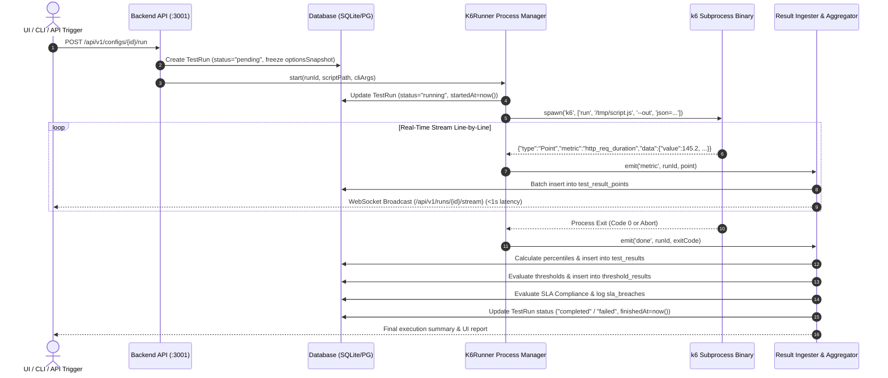
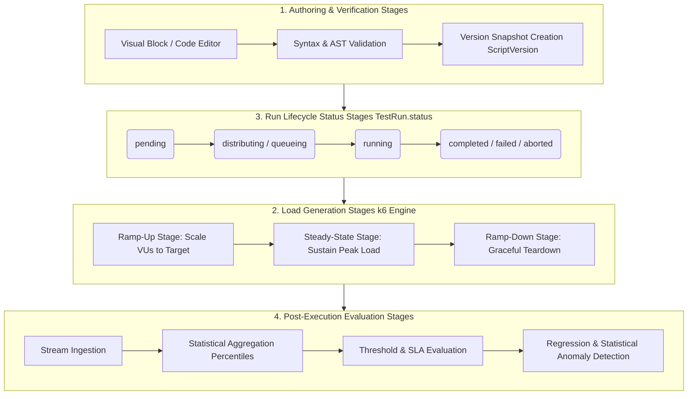

# TenjinT6 — Test Plans, Execution Lifecycle, Data Storage & Stages Guide

This document provides a complete technical reference on **how Test Plans are stored**, **how the execution engine operates**, **how metrics and validation data are persisted**, and **the distinct stages** across the entire lifecycle of a performance test in **TenjinT6**.

---

## Table of Contents
1. [How Test Plans & Scripts Are Stored](#1-how-test-plans--scripts-are-stored)
   - [Dual-Mode Storage (Blocks vs. Code)](#11-dual-mode-storage-blocks-vs-code)
   - [Database Schema & Versioning Strategy](#12-database-schema--versioning-strategy)
   - [Configurations & Environment Separation](#13-configurations--environment-separation)
2. [How Execution Happens (End-to-End Flow)](#2-how-execution-happens-end-to-end-flow)
   - [Trigger & Snapshot Phase](#21-trigger--snapshot-phase)
   - [Process Spawning & Command Building](#22-process-spawning--command-building)
   - [Line-by-Line Stream Parsing & Real-Time Broadcast](#23-line-by-line-stream-parsing--real-time-broadcast)
   - [Distributed Worker Orchestration](#24-distributed-worker-orchestration)
3. [How Data Is Stored (Database & Storage Layers)](#3-how-data-is-stored-database--storage-layers)
   - [Raw Time-Series Data (`TestResultPoint`)](#31-raw-time-series-data-testresultpoint)
   - [Aggregated Statistical Percentiles (`TestResult`)](#32-aggregated-statistical-percentiles-testresult)
   - [Validation & SLA Storage (`ThresholdResult` & `SlaBreach`)](#33-validation--sla-storage-thresholdresult--slabreach)
   - [HTTP Debug & Audit Logs (`TestRequestLog`)](#34-http-debug--audit-logs-testrequestlog)
4. [Comprehensive Stages & Lifecycle Phases](#4-comprehensive-stages--lifecycle-phases)
   - [1. Test Authoring & Verification Stages](#41-test-authoring--verification-stages)
   - [2. Load Generation Stages (`scenarios` & `stages`)](#42-load-generation-stages-scenarios--stages)
   - [3. Run Lifecycle Status Stages (`TestRun.status`)](#43-run-lifecycle-status-stages-testrunstatus)
   - [4. Post-Execution Evaluation Stages](#44-post-execution-evaluation-stages)

---

## 1. How Test Plans & Scripts Are Stored

TenjinT6 decouples the structural organization of tests (`TestPlan`), the executable logic (`Script`), and the runtime parameters (`TestConfig`).

```
Project (Tenant)
 ├── TestPlan (Visual block containers & overarching test design)
 │    └── Script (Active script body, visual block JSON tree & metadata)
 │         ├── ScriptVersion (Immutable historical backups with code & env snapshots)
 │         └── TestConfig (Execution parameters: VUs, duration, stages, thresholds)
```

### 1.1 Dual-Mode Storage (Blocks vs. Code)
To bridge the gap between no-code visual builders and advanced `k6` code developers, every script stores two parallel representations:
* **Visual Block Tree (`blocks: String?`)**: A serialized JSON tree representing visual drag-and-drop blocks across 9 categories (`Requests`, `Flow Control`, `Validation`, `Scenarios`, `Timing`, `Data`, `Browser`, `Metrics & Debug`, and `Processors`).
* **Compiled k6 JavaScript (`content: String`)**: The actual `k6`-compatible ECMAScript module code executed by the `k6` Go binary. When visual blocks are modified in the UI, the built-in **Code Generator** compiles the block tree into `content`. When raw code is edited via Monaco Editor, the **AST Parser** round-trips the JavaScript back into visual blocks.

### 1.2 Database Schema & Versioning Strategy
All storage models are defined in [`packages/backend/prisma/schema.prisma`](file:///Users/yethi/Workspace/product007/graphanak6/packages/backend/prisma/schema.prisma):

```prisma
model TestPlan {
  id          String   @id @default(uuid())
  projectId   String   @map("project_id")
  name        String
  description String?
  blocks      String   @default("[]") // JSON block tree for plan-level orchestration
  scripts     Script[]
}

model Script {
  id        String   @id @default(uuid())
  projectId String
  name      String
  version   Int      @default(1)
  content   String   // Executable k6 JS code
  filePath  String?  // Optional MinIO / S3 object storage path for large file assets
  blocks    String?  // Visual Block Editor JSON representation
  envVars   String   @default("{}") // Key-value environment variables dictionary
  tags      String   @default("{}") // k6 custom metric tags
  versions  ScriptVersion[]
  configs   TestConfig[]
}

model ScriptVersion {
  id        String   @id @default(uuid())
  scriptId  String   @map("script_id")
  version   Int
  content   String   // Frozen code snapshot at time of save
  envVars   String   @default("{}")
  tags      String   @default("{}")
  createdAt DateTime @default(now())
}
```
Whenever a user manually saves a script (`FR-1.4`), the API increments `Script.version` and inserts an immutable copy into `ScriptVersion`, enabling instant rollback (`FR-1.5`) and side-by-side diffing (`FR-1.6`).

### 1.3 Configurations & Environment Separation
While `Script` defines **what** to execute, `TestConfig` defines **how** to run it:
```prisma
model TestConfig {
  id        String   @id @default(uuid())
  scriptId  String
  name      String
  options   String   @default("{}") // JSON string of k6 execution options
}
```
The `options` JSON object contains all operational parameters without mutating the script:
```json
{
  "vus": 50,
  "duration": "3m",
  "iterations": 1000,
  "scenarios": {
    "peak_load": {
      "executor": "ramping-vus",
      "stages": [
        { "duration": "30s", "target": 20 },
        { "duration": "2m", "target": 50 },
        { "duration": "30s", "target": 0 }
      ]
    }
  },
  "thresholds": {
    "http_req_duration": ["p(95)<500", "p(99)<1000"],
    "http_req_failed": ["rate<0.01"]
  },
  "env": {
    "BASE_URL": "https://staging-api.tenjint6.local"
  }
}
```

---

## 2. How Execution Happens (End-to-End Flow)

Execution is driven by an asynchronous, stream-based pipeline that processes live `k6` JSON outputs with sub-second latency (`NFR-2`).



### 2.1 Trigger & Snapshot Phase
When execution is initiated (`POST /api/v1/configs/{id}/run`), the API freezes all execution options, environment variables, and script contents into a new `TestRun` record (`status: "pending"`). This guarantees that even if the underlying `Script` or `TestConfig` is edited during a long-running load test, historical records remain completely immutable.

### 2.2 Process Spawning & Command Building
The `K6Runner` class (`packages/worker-agent/src/k6Runner.ts` / `packages/backend/src/k6-runner/runner.ts`) constructs exact CLI arguments and spawns the `k6` binary as a child process using Node.js `child_process.spawn()`:
```bash
k6 run /tmp/scripts/run_123_script.js \
  --out json=/tmp/results/run_123_output.json \
  --vus 50 \
  --duration 3m \
  --tag test_run_id=c3a1b2d4-e5f6 \
  --tag project_id=proj-abc \
  --env BASE_URL=https://staging-api.tenjint6.local \
  --quiet --no-usage-report
```

### 2.3 Line-by-Line Stream Parsing & Real-Time Broadcast
The `--out json` flag directs `k6` to emit structured JSON lines to standard output. The runner attaches a Node.js `readline` interface to `proc.stdout` and immediately parses two primary event types:
1. **`Point` Events (Metrics)**:
   ```json
   {
     "type": "Point",
     "metric": "http_req_duration",
     "data": {
       "time": "2026-07-14T13:25:10.123Z",
       "value": 145.2,
       "tags": { "method": "GET", "url": "https://...", "status": "200" }
     }
   }
   ```
   These points are immediately broadcast over WebSockets (`ws.ts`) to connected browsers, updating Recharts live charts (`LiveMonitor.tsx`) within `< 1 second`.
2. **`Status` Events (Engine Health)**:
   Emitted by `k6` to notify the platform of current active VUs and iteration progress.

### 2.4 Distributed Worker Orchestration
If the test is run in **Distributed Mode** (`POST /projects/:pid/configs/:configId/distribute`), the central Master (`workers.ts:L246-385`) slices `totalVUs` evenly across all `online` worker nodes (`Math.floor(totalVUs / onlineWorkers.length)`). Each worker node (`agent.ts`) executes its assigned VU slice independently and streams live metrics back to the Master via `POST /api/v1/runs/:id/metrics`.

---

## 3. How Data Is Stored (Database & Storage Layers)

TenjinT6 separates **Hot Streaming Data** (raw data points collected during live execution) from **Cold Analytical Data** (pre-calculated percentiles and summaries).

```
Database Storage Layers
 ├── Hot Storage (High-Write Partitioned / Indexed Table)
 │    └── TestResultPoint (Raw timestamps, metric values, and tags)
 ├── Cold Storage (Post-Run Aggregated Tables)
 │    ├── TestResult (avg, min, max, med, p90, p95, p99, count, rate)
 │    ├── ThresholdResult (Rule evaluation outcome: passed/failed)
 │    └── SlaBreach (SLA compliance violation audit trail)
 └── Debug & Diagnostic Logs
      ├── TestRequestLog (HTTP headers, status codes, request timing)
      └── AuditLog (User mutations across scripts and configs)
```

### 3.1 Raw Time-Series Data (`TestResultPoint`)
During test execution, `ResultIngester` (`packages/backend/src/workers/index.ts`) batch-inserts raw data points into `test_result_points`:
```prisma
model TestResultPoint {
  id          Int      @id @default(autoincrement())
  testRunId   String
  timestamp   DateTime
  metricName  String   // http_req_duration, http_reqs, vus, iterations, data_received
  metricValue Float
  tags        String   @default("{}") // JSON string of tags (method, url, status)

  @@index([testRunId])
}
```
*(In production PostgreSQL deployments, this table is partitioned by `testRunId` or `timestamp` to ensure lightning-fast ingestion and query pruning).*

### 3.2 Aggregated Statistical Percentiles (`TestResult`)
Because storing millions of raw points is inefficient for long-term trend dashboards (`FR-6.3`), `ResultService` calculates and aggregates full statistical percentiles once the test run completes (`exitCode` received):
```prisma
model TestResult {
  id         String   @id @default(uuid())
  testRunId  String
  metricName String   // http_req_duration, http_req_connecting, http_req_tls_handshaking
  metricType String   // "trend" | "counter" | "gauge" | "rate"
  avg        Float?   // Mean value across all iterations
  min        Float?   // Minimum value observed
  max        Float?   // Maximum value observed
  med        Float?   // p50 (Median)
  p90        Float?   // 90th percentile
  p95        Float?   // 95th percentile
  p99        Float?   // 99th percentile
  count      Int?     // Total occurrences (e.g., total HTTP requests)
  rate       Float?   // Ratio / percentage (e.g., error rate 0.012 = 1.2%)
  value      Float?   // Single scalar value for gauges
  tags       String   @default("{}")
}
```
This enables the **Dashboard Builder (`FR-7`)** and **Regression Detection (`FR-6.6`)** engines to execute instantaneous SQL queries across historical runs without reading raw points.

### 3.3 Validation & SLA Storage (`ThresholdResult` & `SlaBreach`)
Pass/fail thresholds (`p(95)<500`, `rate<0.01`) evaluated against the aggregated percentiles are stored in `ThresholdResult`:
```prisma
model ThresholdResult {
  id            String  @id @default(uuid())
  testRunId     String
  metricName    String
  thresholdExpr String  // "p(95)<500"
  passed        Boolean // true / false
  actualValue   Float?  // e.g., 420.5
}
```
Simultaneously, the **SLA Management Engine (`FR-9`)** evaluates project-wide SLAs (`SlaRule`) and logs violations into `SlaBreach`:
```prisma
model SlaBreach {
  id          String   @id @default(uuid())
  slaRuleId   String   @map("sla_rule_id")
  runId       String?  @map("run_id")
  metric      String
  actualValue Float    @map("actual_value")
  threshold   Float
  message     String?  // e.g., "SLA breached: p95 duration (612ms) exceeded threshold (500ms)"
  breachedAt  DateTime @default(now())
}
```

### 3.4 HTTP Debug & Audit Logs (`TestRequestLog`)
When HTTP debugging or recording (`FR-1.7`, `--http-debug`) is enabled, exact HTTP transactions are captured in `TestRequestLog`:
```prisma
model TestRequestLog {
  id        String   @id @default(uuid())
  testRunId String
  method    String   // GET, POST, PUT, DELETE
  url       String   // Full endpoint URI
  status    Int      // HTTP status code (200, 404, 500)
  body      String?  // Request / Response body preview
  headers   String?  // JSON string of headers
  timing    Float?   // Total round-trip time in ms
}
```

---

## 4. Comprehensive Stages & Lifecycle Phases

A performance test in TenjinT6 transitions across four distinct operational stages:



### 4.1 Test Authoring & Verification Stages
1. **Creation Stage**: User builds the test using either the `Visual Block Editor` (drag-and-drop tree) or `Monaco Code Editor`.
2. **Validation Stage**: The platform verifies that the script contains a valid `default function` entry point and checks that required environment variables are defined.
3. **Snapshot Stage**: Upon save or run trigger, `Script.version` is incremented and `ScriptVersion` is written to guarantee auditability.

### 4.2 Load Generation Stages (`scenarios` & `stages`)
Inside the `k6` load generator, execution progresses through configured operational stages (`options.stages`):
* **Stage 1: Ramp-Up (`ramp_up`)**: Virtual Users gradually increase from `0` to the configured target (`e.g., { duration: "30s", target: 50 }`). This simulates user traffic surging during morning login spikes without shocking the target server instantaneously.
* **Stage 2: Steady-State (`steady_state`)**: Active VUs hold constant at peak capacity (`e.g., { duration: "3m", target: 50 }`) to measure sustained server throughput (`http_reqs/s`), connection pooling, and memory leakage.
* **Stage 3: Ramp-Down (`ramp_down`)**: VUs gradually scale down to `0` (`e.g., { duration: "30s", target: 0 }`) to test server socket release and connection cleanup.

### 4.3 Run Lifecycle Status Stages (`TestRun.status`)
Every `TestRun` database entity transitions through strict state machine statuses:
1. **`pending`**: Test run created in database; options snapshot frozen; job dispatched to RabbitMQ (`amqplib`) or local process queue.
2. **`distributing`**: *(Distributed Mode Only)* Master is querying online worker agents and dispatching HTTP `POST /run` payloads with VU slices (`WorkerRunAssignment`).
3. **`running`**: Worker agent(s) accepted the payload; `k6` binary subprocess actively running; real-time JSON metrics streaming to `TestResultPoint` and WebSockets.
4. **`completed`**: `k6` subprocess exited with code `0`; all results aggregated successfully.
5. **`failed`**: `k6` subprocess exited with non-zero error code (e.g., syntax error, connection refused, threshold abort `--thresholds-abort-on-fail`).
6. **`aborted`**: User manually terminated the run via `POST /api/v1/runs/{id}/abort` (`FR-3.3`); worker executed `process.kill('SIGTERM')`.

### 4.4 Post-Execution Evaluation Stages
Once `k6` finishes, `ResultIngester` executes four automated analytical evaluations:
1. **Statistical Aggregation Stage**: Iterates through all `TestResultPoint` records for the run and computes `avg, min, max, med, p90, p95, p99` into `TestResult`.
2. **Threshold Evaluation Stage**: Compares computed percentiles against configured expressions (`p(95)<500`, `rate<0.01`). Marks each rule as `passed: true/false` inside `ThresholdResult`.
3. **SLA Compliance Check Stage (`FR-9.2`)**: Queries all active `SlaRule` definitions for the project (`timeWindow: 24h`). If any metric breaches its SLA condition (`lt, gt`), a violation record is written to `SlaBreach` and alerting workflows (`Slack`, `Webhook`, `Email`) are triggered (`FR-8`).
4. **Regression & Statistical Anomaly Detection Stage (`FR-6.5, FR-6.6`)**:
   * **Regression Detection**: Compares the current run's `p95` response times against the baseline or average of the previous 10 runs for the same script. If degradation exceeds configurable thresholds (e.g., `> 15% slower`), a regression warning is flagged.
   * **Statistical Anomaly Detection**: Calculates standard deviation across historical runs. If current throughput (`RPS`) or latency deviates by more than `2 standard deviations (2σ)`, it is marked as an anomaly.
