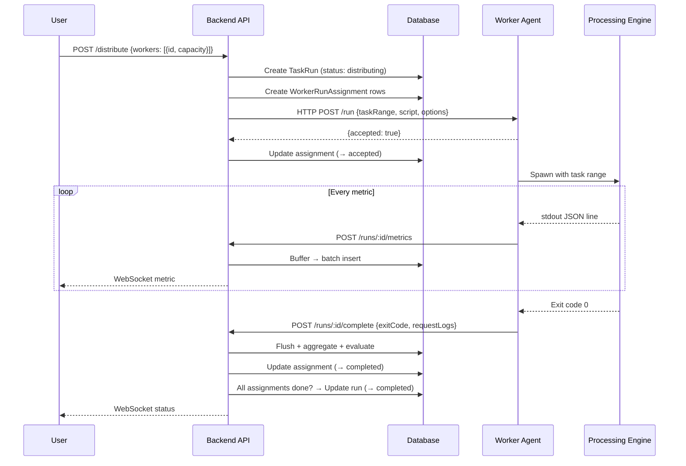

# Skill: Flow & Orchestration Mapping

> Trace the path of every request, event, and state transition. Understand the sequence before optimizing the parts.

---

## What It Is

The ability to map **end-to-end execution flows** — sequences of events, state transitions, error paths, and actor responsibilities — before implementing any piece. You care about the order of things: what happens first, what happens on failure, and what happens next.

```
Input (user click / API call / cron / webhook)
  │
  ├─ Validation
  ├─ State change (pending → running)
  ├─ Side effect (enqueue message)
  ├─ External system (RabbitMQ → Worker)
  ├─ Callback (metric arrives → store + broadcast)
  ├─ Completion handler (aggregate → evaluate → advance)
  └─ Output (response / WebSocket push / notification)
```

---

## When To Use

- Designing **stateful workflows** (test execution, deployment pipelines, order processing)
- Building **event-driven systems** (message queues, WebSockets, webhooks)
- Implementing **distributed transactions** (multiple workers, eventual consistency)
- Debugging **race conditions** or **ordering bugs**
- Any feature with the words "then", "after that", "when X completes"

---

## Workflow

### Step 1: Identify the Flow Entry Points

Every flow starts somewhere:
```
User click "Run"       → POST /configs/:id/run
Cron schedule fires    → scheduler.execute()
CI/CD webhook          → POST /trigger
Suite advancement      → advanceSuite() after run completes
Worker reports back    → POST /runs/:id/complete
```

### Step 2: Map the State Machine

Define all states and valid transitions:

**TestRun states:**
```
pending → running → completed
pending → running → failed
pending → running → aborted
pending → distributing → running → completed
pending → distributing → failed
```

**WorkerRunAssignment states:**
```
pending → accepted → running → completed
pending → accepted → running → failed
pending → rejected
```

### Step 3: Trace the Happy Path

Write the sequence in detail:

```
POST /configs/:id/run
  1. Validate config exists
  2. Fetch config + script + env vars
  3. Replace __TARGET_URL__ in script content
  4. Detect CSV file references
  5. Create TestRun (status: pending)
  6. Enqueue to RabbitMQ 'run-test' queue
  7. Return { runId }
  ─────────────────────────────────
  RabbitMQ consumer picks up:
  8. Parse message payload
  9. Update status → running
  10. Write script to temp file
  11. Spawn subprocess engine
  12. Parse stdout for metric lines
  13. For each metric:
      a. Store in buffer (ResultIngester)
      b. Broadcast via WebSocket
  14. On process exit:
      a. Flush buffer → batch insert
      b. Aggregate → TestResult rows
      c. Evaluate thresholds → ThresholdResult rows
      d. Evaluate alerts → AlertEvent rows
      e. Evaluate SLA → SlaBreach rows
      f. Update status → completed/failed
      g. advanceSuite() if part of suite
```

### Step 4: Trace Error Paths

For every step in the happy path, ask "what if this fails?":

```
Step 2: Script not found? → 404
Step 4: CSV file not found? → Log warning, continue without it
Step 6: RabbitMQ down? → Run saved as pending, will never execute
Step 11: Subprocess engine binary not found? → Set status = failed, broadcast error
Step 13: DB insert fails? → Log error, retry in next flush cycle
Step 14c: Threshold evaluation throws? → Log error, mark run as completed with partial results
```

**Recovery strategies per failure type:**
| Failure | Strategy |
|---------|----------|
| Transient DB error | Retry with backoff |
| Subprocess engine crash | Set status to failed, store exit code |
| RabbitMQ unavailable | Keep run as pending, manual retry |
| Metric point with bad format | Skip silently, log warning |
| Worker agent unreachable | Mark assignment as failed, try other workers |

### Step 5: Map the Distributed Flow

When multiple actors are involved, use a swimlane diagram:

```
[User]                [Backend API]           [Worker Agent]         [Engine]
  │                       │                       │                   │
  │ POST /distribute      │                       │                   │
  │──────────────────────>│                       │                   │
  │                       │ Create TestRun        │                   │
  │                       │ (status: distributing)│                   │
  │                       │ Create Assignments    │                   │
  │                       │ (status: pending)     │                   │
  │                       │                       │                   │
  │                       │ POST /run             │                   │
  │                       │──────────────────────>│                   │
  │                       │                       │ Update assignment │
  │                       │                       │ (→ accepted)      │
  │                       │                       │ Spawn Engine      │
  │                       │                       │──────────────────>│
  │                       │                       │                   │
  │                       │ POST /runs/:id/metrics│                   │
  │                       │◄──────────────────────│ (every 2s)        │
  │                       │                       │                   │
  │ WebSocket metric      │                       │                   │
  │◄──────────────────────│                       │                   │
  │                       │                       │                   │
  │                       │ POST /runs/:id/complete│                  │
  │                       │◄──────────────────────│ (on exit)         │
  │                       │                       │                   │
  │ WebSocket status      │ aggregateAll()        │                   │
  │◄──────────────────────│ advanceSuite()        │                   │
```

### Step 6: Identify Parallel vs Sequential

**Sequential (suite run):**
```
Run Script A → [A completes] → Run Script B → [B completes] → Done
```

**Parallel (distributed run):**
```
                   ┌─ Worker 1 → Run VUs 1-30 ─┐
Create Parent Run ─┼─ Worker 2 → Run VUs 31-60 ─┼─ Wait for all → Aggregate
                   └─ Worker 3 → Run VUs 61-100 ─┘
```

---

## Templates

### Flow Mapping Template

```markdown
## Flow: {name}

### Entry Points
- {trigger 1}
- {trigger 2}

### States
- {state 1} → {state 2} → {state 3}

### Happy Path
1. {step 1}
2. {step 2}
...

### Error Paths
| Step | Failure | Behavior |
|------|---------|----------|
| {n}  | {what}  | {recovery}|

### Actors
| Actor | Responsibilities |
|-------|-----------------|
| ...   | ...              |
```

### State Machine Checklist

```
□ 1. All states enumerated?
□ 2. Valid transitions defined?
□ 3. Invalid transitions handled?
□ 4. Terminal states identified? (completed, failed, aborted)
□ 5. Timeouts defined? (stuck in "running" for 1 hour?)
□ 6. Concurrency handled? (two workers completing at the same time?)
```

---

## Real Example from This Project

**Distributed Run Flow** (the most complex flow in the system):



---

## Anti-Patterns

| Trap | Why It Fails |
|------|-------------|
| Ignoring error paths until they happen | You'll have half-complete runs with no recovery |
| Assuming synchronous execution | Real systems have timeouts, retries, race conditions |
| Not defining terminal states | Runs get stuck in "running" forever |
| Mixing sequential and parallel without explicit design | Suite runs and distributed runs have different orchestration needs |
| No timeout on external calls | A dead worker blocks the entire flow |
